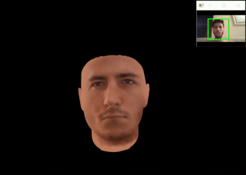
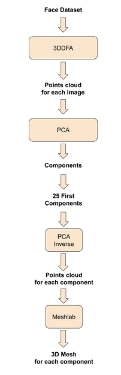
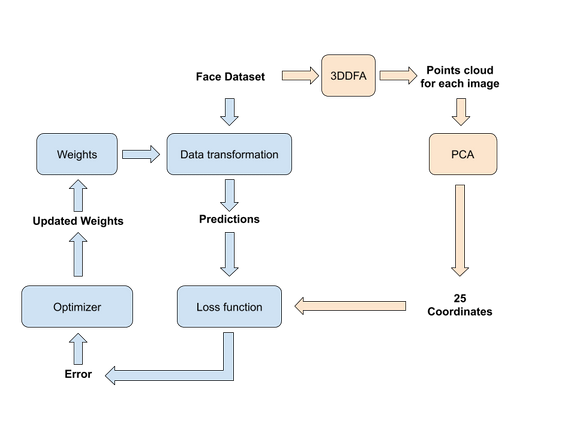
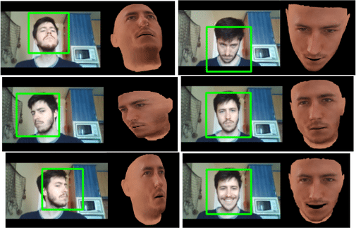
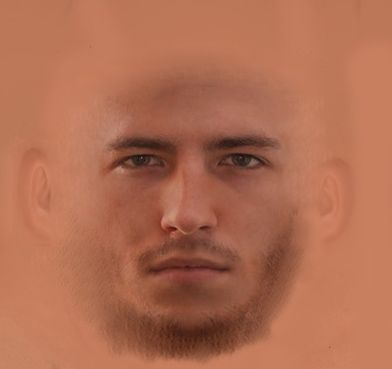

# realtime-2D-to-3D-faces

  
  

## Introduction
In this project, an infrastructure capable of reconstructing real-time 3D
faces has been set up using 2D images using deep learning.
Given a video stream we process each  frame  with  the  model  learned  and
we  visualize  the  reconstruction  of  the 3D face using the WebGL Studio 
platform.  

One of the main objectives of the project is to obtain an intermediate 
representation that allows to send the data of the faces in an efficient way
for its use in videoconferencing. In order to obtain this representation, a PCA model has been created 
representing all possible 3D configurations that are wanted to take into 
account. To do this, the AFLW2000-3D dataset has been used and processed with the 
3DDFA library to obtain the corresponding 3D face points clouds. 
Once the model has been created, a neural network has been trained using the
Resnet architecture where the input data is the 2D images used to learn the
PCA model and the output ones its projection on the subspace learned through 
PCA. 
Finally, these coordinates are used to reconstruct and draw the 3D point 
cloud using WebGL Studio.

## Creating the PCA Model and the Meshes for WebGlStudio

## Training the main model

## Using the model

## Results
  

## Assets
##### Used texture (manually made just to test the system):

## Disclaimers
* AFLW2000-3D is not included.
* 3DDFA and PCA implementations are not included.
* Trained PCA Model and Main Model are not included.
* You have all steps summarized in images, if you need more details send me a message. 
* WebGlStudio part is not explained but you can contact me if you need more information.

## Authors
* **Marc Alcaraz** - *Project author* - [marcalcarazf](https://github.com/marcalcarazf/)
* **Decky Aspandi** - *Original training scripts author* - [deckyal](https://github.com/deckyal/)

## License
This project is licensed under the GNU License - see the [LICENSE.md](LICENSE.md) file for details.
